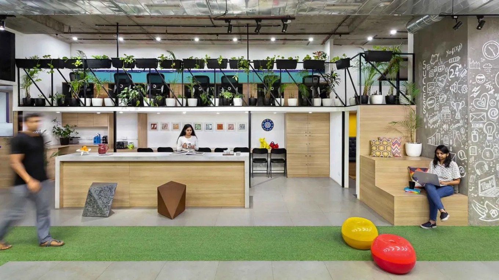

# Proyecto 8: Predicción de retención de empleados




## Planteamiento del problema 🏢 🏢

- Este proyecto forma parte de un máster de formación en Data Science e Inteligencia Artificial.

- Esta vez, nos toca trabajar en Recursos Humanos, y enfrentarnos a uno de los mayores dolores de cabeza de cualquier empresa: la rotación de empleados. ¿Por qué algunas personas deciden quedarse mientras otras se van? ¿Será el salario? ¿Las horas extra? ¿La relación con su jefe?

- En este proyecto, usaremos datos recopilados de una empresa ficticia (¡no, no es información confidencial!) que incluye desde encuestas de satisfacción hasta métricas de desempeño y horarios laborales. La tarea consiste en desentrañar patrones, analizar tendencias y construir un modelo que pueda predecir si un empleado permanecerá o decidirá decir adiós.

- Pero esto no es solo sobre números y gráficos; se trata de entender cómo las decisiones empresariales impactan la vida de las personas y cómo, con un poco de análisis, podríamos ayudar a las empresas a ser mejores lugares para trabajar. Así, nos preparamos para explorar datos, ensuciarnos las manos con algoritmos y, quién sabe, tal vez descubrir el secreto para mantener a los empleados felices y comprometidos.

- Este proyecto va más allá de un ejercicio técnico, también es un entrenamiento toma de decisiones basadas en datos. 


## Objetivos del Proyecto

- El principal desafío de este proyecto es abordar una de las preguntas más importantes para cualquier departamento de Recursos Humanos: ¿qué empleados tienen más probabilidades de quedarse en la empresa y cuáles podrían decidir irse? Para lograr esto, el trabajo será construir un modelo de machine learning capaz de predecir si un empleado permanecerá en la empresa o decidirá marcharse. 

- El enfoque no solo será técnico. A través del análisis de los datos, identificaremos cuáles son los factores más influyentes en la retención o rotación del personal. Por ejemplo:
   - ¿Es la satisfacción laboral un predictor clave?
   - ¿Tienen más probabilidades de irse quienes trabajan largas horas o aquellos con relaciones tensas con sus jefes?
   - ¿Qué papel juegan las promociones o los aumentos de salario?

- El modelo debe ser capaz de responder estas preguntas y ofrecer predicciones precisas que puedan usarse para tomar decisiones informadas. Esto significa que, además de construir un modelo que funcione, se deben  interpretar sus resultados y proponer estrategias basadas en ellos.

- Como reto adicional, nos hemos propuesto crear una app de *streamlit* capaz de hacer una consulta a través de una API de *flask*, de modo que pueda enviarse información a través de un formulario web a la API, que será quién procese la consulta y devuelva por la misma vía la respuesta, que se mostrará en la web creada.


## Estructura del repositorio

El proyecto está construido de la siguiente manera:

- **datos/**: Carpeta que contiene archivos `.csv`, `.json` o `.pkl` generados durante la captura y tratamiento de los datos.

- **flask/**: Carpeta que contiene un archivo `.py` para la ejecución de la API de *Flask*. Dentro también un Jupyter Notebook para pruebas de la API.

- **images/**: Carpeta que contiene archivos de imagen generados durante la ejecución del código o de fuentes externas.

- **notebooks/**: Carpeta que contiene los archivos `.ipynb` utilizados en la captura y tratamiento de los datos. Están numerados para su ejecución secuencial, y contenidos dentro de 5 carpetas, una para cada modelo, conteniendo cada una de ellas:
  - `1_EDA`
  - `2_Encoding`
  - `3_Outliers`
  - `4_Estandarización`
  - `5_Modelos`

- **src/**: Carpeta que contiene los archivos `.py`, con las funciones y variables utilizadas en los distintos notebooks.

- **streamlit/**: Carpeta que contiene un archivo `.py` para la ejecución de la app *streamlit*.

- `.gitignore`: Archivo que contiene los archivos y extensiones que no se subirán a nuestro repositorio, como los archivos .env, que contienen contraseñas.


## Lenguaje, librerías y temporalidad
- El proyecto fué elaborado con Python 3.9 y múltiples librerías de soporte:

| **Categoría**                             | **Enlace**                                                                                 |
|-------------------------------------------|-------------------------------------------------------------------------------------------|
| *Librerías para el tratamiento de datos*  | [Pandas](https://pandas.pydata.org/docs/)                                                 |
|                                           | [Numpy](https://numpy.org/doc/)                                                           |
|                                           | [pickle](https://docs.python.org/3/library/pickle.html)                                                           |
| *Librerías para gestión de APIs*         | [Requests](https://pypi.org/project/requests/)                                            |
| *Librerías para gestión de tiempos*       | [Time](https://docs.python.org/3/library/time.html)                                       |
|                                           | [tqdm](https://numpy.org/doc/)                                                            |
| *Librerías para gráficas*                 | [Plotly](https://plotly.com/python/)                                                      |
|                                           | [Seaborn](https://seaborn.pydata.org)                                                     |
|                                           | [Matplotlib](https://matplotlib.org/stable/index.html)                                    |
|                                           | [shap](https://shap.readthedocs.io/en/latest/)                                            |
| *Librería para controlar parámetros del sistema* | [Sys](https://docs.python.org/3/library/sys.html)                                        |
| *Librería para controlar ficheros*        | [os](https://docs.python.org/3/library/os.html)                                           |
| *Librería para generar aplicaciones basadas en Python* | [streamlit](https://docs.streamlit.io)                                                  |
| *Librería para generar APIs basadas en Python* | [flask](https://flask.palletsprojects.com/en/stable/)                                    |
| *Librería para creación de modelos de Machine Learning* | [scikitlearn](https://scikit-learn.org/stable/)                                         |
| *Librería para la gestión del desbalanceo* | [imblearn](https://imbalanced-learn.org/stable/)                                          |
| *Librería para creación de iteradores (utilizada para combinaciones)* | [itertools](https://docs.python.org/3/library/itertools.html)                           |
| *Librería para la gestión de avisos*      | [warnings](https://docs.python.org/3/library/warnings.html)                               |

- Este proyecto es funcional a fecha 1 de diciembre de 2024.


## Instalación

1. Clona el repositorio
   ```sh
   git clone https://github.com/davfranco1/Proyecto8-PrediccionRetencionEmpleados.git
   ```

2. Instala las librerías que aparecen en el apartado anterior. Utiliza en tu notebook de Jupyter:
   ```sh
   pip install nombre_librería
   ```

3. Cambia la URL del repositorio remoto para evitar cambios al original.
   ```sh
   git remote set-url origin usuario_github/nombre_repositorio
   git remote -v # Confirma los cambios
   ```

4. Ejecuta el código en los notebooks, modificándolo si es necesario.

5. Para utilizar la app de Streamlit (que llama a una API de flask para la consulta) y realizar una predicción, tras copiar el repositorio:
   - Abre una terminal en la carpeta `flask`, y ejecuta el comando `python run main.py`, que abrirá una terminal que servirá para el debugging y pondrá en marcha el servidor.
   - Sin cerrarla la anterior, abre otra terminal en la carpeta `streamlit`, y ejecuta el comando `streamlit run main.py`, que abrirá un navegador donde se ejecuta automáticamente el código.
   - Recuerda que antes, debes haber instalado las librerías correspondientes (flask y streamlit).


## Resultados, conclusiones y recomendaciones

- La siguiente tabla resumen muestra cómo se han tratado los datos en las distintas etapas del preprocesamiento, y los resultados obtenidos tras probar modelos utilizando la Regresión Logística, Decision Tree, Random Forest, Gradient Boosting y XGBoost.

| **Modelo** | **Duplicados** | **Encoding** | **Outliers**    | **Estandarización** | **Desbalanceo** | **Mejor modelo** | **Recall**   | **Kappa**    |
|------------|----------------|--------------|------------------|----------------------|-----------------|------------------|--------------|--------------|
| 1          | Se mantienen   | Catboost     | 42 eliminados    | Standard             | No gestionado   | XGBoost          | 1 / 0.97     | 1 / 0.88     |
| 2          | Se eliminan    | Target       | 16 eliminados    | Standard             | No gestionado   | GradientBoost    | 1 / 0.83     | 0.99 / 0.24  |
| 3          | Se eliminan    | Target       | 16 eliminados    | Standard             | 59%-41%         | Random Forest    | 0.95 / 0.88  | 0.89 / 0.75  |
| 4          | Se eliminan    | Catboost     | 13 eliminados    | Standard             | 59%-41%         | XGBoost          | 1 / 0.86     | 1 / 0.71     |
| 5          | Se eliminan    | Target       | 15 eliminados    | Standard             | 50-50%          | DecisionTree     | 0.96 / 0.79  | 0.93 / 0.57  |

- Nos hemos quedado con el Modelo #5 usando el Decision Tree, por ser el que mejores métricas aporta controlando el overfitting. Al entrenar el modelo con todos los datos, hemos obtenido un recall de 0.90 y una kappa de 0.81.

- Una explicación completa de las métricas y las representaciones gráficas del modelo se pueden consultar en el Notebook [Modelo 5-5_Modelos](notebooks/modelo5/5-5_Modelos.ipynb).

- De la misma manera, disponible un PDF resumen con la presentación del problema, los datos, resultados, el modelo elegido, conclusiones y recomendaciones. Disponible para descarga [aquí](datos/Resumen.pdf).

- Para realizar una predicción, tras copiar el repositorio, entra en la carpeta `flask`, y ejecuta desde la terminal el archivo `.py` disponible: 
   ```sh
   python run main.py
   ```

- Repite el proceso entrando en la carpeta `streamlit`, y ejecuta desde la terminal el archivo `.py` disponible: 
   ```sh
   streamlit run main.py
   ```

## Autor

David Franco - [LinkedIn](https://linkedin.com/in/franco-david)

Enlace del proyecto: [https://github.com/davfranco1/Proyecto8-PrediccionRetencionEmpleados](https://github.com/davfranco1/Proyecto8-PrediccionRetencionEmpleados)
